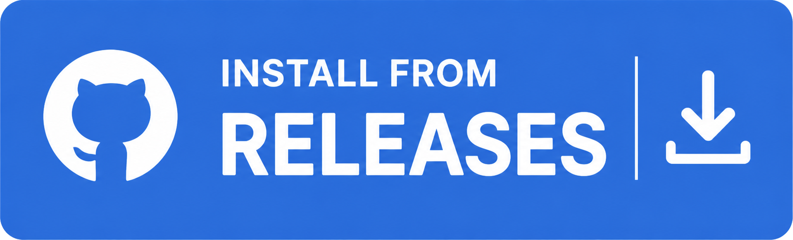

# RL Map Loader

Application for loading custom Rocket League maps on Epic Games without Bakkesmod.

## Features

- **Cross-platform**: Works on Windows and Linux
- **Drag & drop**: Add custom maps by dragging `.udk` or `.upk` files into the app
- **Safe backups**: Automatically backs up the original map before loading a custom one
- **Easy restore**: Restore the original map with a single click

## Installation

### From releases

[](https://github.com/marzeq/rl-map-loader/releases/latest)

Grab the appropriate release archive for your platform from the [Releases](https://github.com/marzeq/rl-map-loader/releases/latest) page,
extract it, and run the executable.

### From source

#### Prerequisites

- Python 3.10 or higher
- `uv` package manager

#### Setup

1. Clone or navigate to this repository
2. Install dependencies:

```bash
uv sync
```

#### Run

```bash
uv run rl-map-loader
```

## Usage

### First Launch

First, you'll need to specify your Rocket League installation folder:

- **Windows**: Default is `C:\Program Files\Epic Games\rocketleague`
- **Linux**: Default is `~/Games/Heroic/rocketleague`

If the default is not correct, type or paste in the correct path directly and press **Confirm**

### Loading Custom Maps

1. **Add maps**: Drag `.udk` or `.upk` files directly into the app window.
2. **Select a map**: Click on a map from the "Custom Maps" list
3. **Load the map**: Click the "Load Selected Map" button. The app will:
   - Back up the original `Labs_Underpass_P.upk` file (if no backup exists)
   - Replace it with your custom map
4. **Restore the original**: Click "Restore Original" to revert to the original map and clean up the backup

### Loading custom map in-game

1. Launch Rocket League

> You should be able to launch it without Anti-Cheat (EAC), but just in case, make sure to launch it without EAC

2. Open free-play training and select map **Underpass - Soccar**

### Managing Custom Maps

Select a map and click **Remove selected** to delete it from your user data directory. This will not affect the original map or any backups.

## Troubleshooting

- **"Invalid Rocket League installation path"**: Make sure the path points to your Rocket League install folder and contains the `TAGame/CookedPCConsole` directory

- **Maps not appearing**: Make sure you're dragging actual `.udk` or `.upk` files

- **Permission denied errors**: Ensure you have write permissions to your Rocket League installation folder
